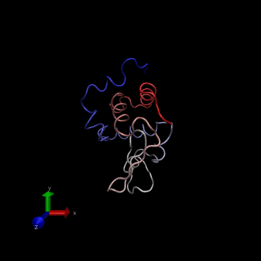

Structural Bioinformatics II
================
Raghav Chanchani
11/13/2018

HIV Structural Bioinformatics
=============================

Splitting up PDB files into proteins and ligands
------------------------------------------------

We will first download and read in the 1hsg protein from PDB.

``` r
library(bio3d)
prot <- get.pdb("1hsg")
```

Then, we will read in the strucutre of the protein and the ligand bound to it, and split up these two components into separate files to attempt docking of ligands into the protein. This is done after removing the water molecules in the structure.

``` r
hiv <- read.pdb(prot)
prot <- trim.pdb(hiv, "protein")
lig <-trim.pdb(hiv, "ligand")
write.pdb(prot, file="1hsg_protein.pdb")
write.pdb(lig, file="1hsg_ligand.pdb")
```

Docking with Vina
-----------------

We run this command: `~/Downloads/autodock_vina_1_1_2_mac/bin/vina --config config.txt --log log.txt` This extracts the docking results and saves the orientations as PDBs.

``` r
res <- read.pdb("all.pdbqt", multi=TRUE)
write.pdb(res, "results.pdb")
```

To assess the results quantitatively we will calculate the RMSD (root mean square distance) between each of the docking results and the known crystal structure using the bio3d package. Read the original ligand with added hydrogens that you produced earlier and use the rmsd() function to compare to the docking results.

``` r
#res <- read.pdb("all.pdbqt", multi=TRUE)
ori <- read.pdb("1hsg_ligand.pdbqt")
rmsd(ori, res)
```

    ##  [1]  0.590 11.163 10.531  4.364 11.040  3.682  5.741  3.864  5.442 10.920
    ## [11]  4.318  6.249 11.084  8.929

We see that the RMSD values do not always correspond to the energy affinity of the docking conformations. The values left to right of RMSD output are in order of energy preference and in units of angstroms.

``` r
res <- read.pdb("all.pdbqt", multi=TRUE)
write.pdb(res, "results.pdb")
```

Normal Mode Analysis
--------------------

Read in the hen egg white lysozome and perform Normal Mode Analysis.

``` r
pdb <- read.pdb("1HEL")
```

    ##   Note: Accessing on-line PDB file

``` r
modes <- nma(pdb)
```

    ##  Building Hessian...     Done in 0.017 seconds.
    ##  Diagonalizing Hessian...    Done in 0.079 seconds.

``` r
plot(modes, sse=pdb)
```

 Visualize the normal mode analysis results shown in the figure above.

``` r
mktrj(modes, mode=7, file="nma_7.pdb")
```


