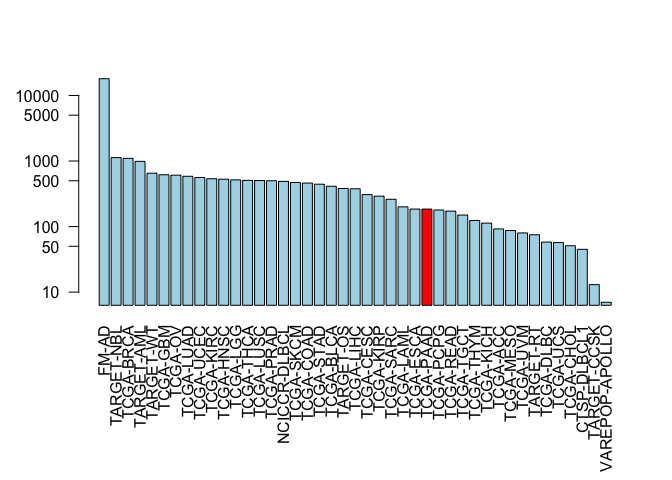
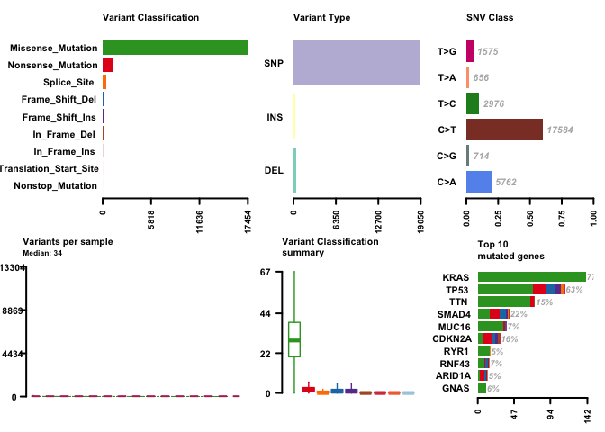
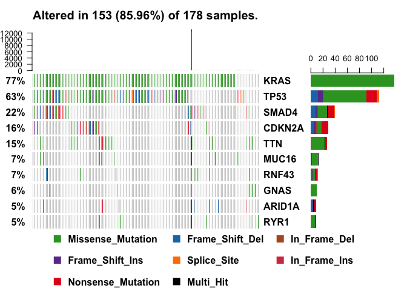
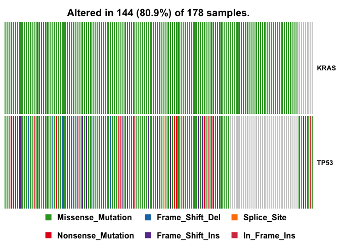
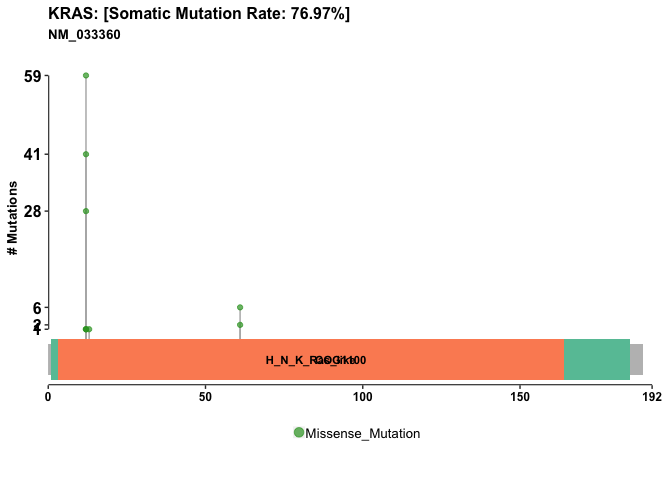

Cancer Genomics and Immunoinformatics
================
Raghav Chanchani
11/29/2018

Accessing Data
--------------

Load somatic variants for a representative TCGA dataset, in this case pancreatic adenocarcinoma. Load maftools to provide rich summaries of the data.

``` r
library(GenomicDataCommons)
library(maftools)
```

Check the dataset status to make sure data retrieval is working.

``` r
GenomicDataCommons::status()
```

    ## $commit
    ## [1] "acaf65369f6cea8337c6b59f0888761c9ed34654"
    ## 
    ## $data_release
    ## [1] "Data Release 13.0 - September 27, 2018"
    ## 
    ## $status
    ## [1] "OK"
    ## 
    ## $tag
    ## [1] "1.17.1"
    ## 
    ## $version
    ## [1] 1

Querying the GDC
----------------

The facet() and aggregations() functions here are from the GenomicDataCommons package and act to group all cases by the project id and then count them up.

``` r
cases_by_project <- cases() %>%
  facet("project.project_id") %>%
  aggregations()
head(cases_by_project)
```

    ## $project.project_id
    ##               key doc_count
    ## 1           FM-AD     18004
    ## 2      TARGET-NBL      1127
    ## 3       TCGA-BRCA      1098
    ## 4      TARGET-AML       988
    ## 5       TARGET-WT       652
    ## 6        TCGA-GBM       617
    ## 7         TCGA-OV       608
    ## 8       TCGA-LUAD       585
    ## 9       TCGA-UCEC       560
    ## 10      TCGA-KIRC       537
    ## 11      TCGA-HNSC       528
    ## 12       TCGA-LGG       516
    ## 13      TCGA-THCA       507
    ## 14      TCGA-LUSC       504
    ## 15      TCGA-PRAD       500
    ## 16   NCICCR-DLBCL       489
    ## 17      TCGA-SKCM       470
    ## 18      TCGA-COAD       461
    ## 19      TCGA-STAD       443
    ## 20      TCGA-BLCA       412
    ## 21      TARGET-OS       381
    ## 22      TCGA-LIHC       377
    ## 23      TCGA-CESC       307
    ## 24      TCGA-KIRP       291
    ## 25      TCGA-SARC       261
    ## 26      TCGA-LAML       200
    ## 27      TCGA-ESCA       185
    ## 28      TCGA-PAAD       185
    ## 29      TCGA-PCPG       179
    ## 30      TCGA-READ       172
    ## 31      TCGA-TGCT       150
    ## 32      TCGA-THYM       124
    ## 33      TCGA-KICH       113
    ## 34       TCGA-ACC        92
    ## 35      TCGA-MESO        87
    ## 36       TCGA-UVM        80
    ## 37      TARGET-RT        75
    ## 38      TCGA-DLBC        58
    ## 39       TCGA-UCS        57
    ## 40      TCGA-CHOL        51
    ## 41    CTSP-DLBCL1        45
    ## 42    TARGET-CCSK        13
    ## 43 VAREPOP-APOLLO         7

The number of cases for each type of cancer.

``` r
x <- cases_by_project$project.project_id
# Make a custom color vector for our plot
colvec <- rep("lightblue", nrow(x))
colvec[x$key == "TCGA-PAAD"] <- "red"

# Plot with 'log' for y axis and rotate labels with 'las'
par(mar=c(9, 4, 4, 2) + 0.1)  
barplot(x$doc_count, names.arg=x$key, log="y", col=colvec, las=2)
```



Find all gene expression data files for all pancreatic cancer patients.

``` r
file_records <- files() %>%
  filter(~ cases.project.project_id == "TCGA-PAAD" &
    data_type == "Gene Expression Quantification" &
    analysis.workflow_type == "HTSeq - Counts") %>%
  response_all()

#View(file_records)
nrow(file_records$results)
```

    ## [1] 182

``` r
head(file_records$results)
```

    ##                        data_type                 updated_datetime
    ## 1 Gene Expression Quantification 2018-09-11T22:53:33.639292+00:00
    ## 2 Gene Expression Quantification 2018-09-11T22:53:33.639292+00:00
    ## 3 Gene Expression Quantification 2018-09-11T22:53:33.639292+00:00
    ## 4 Gene Expression Quantification 2018-09-11T22:53:33.639292+00:00
    ## 5 Gene Expression Quantification 2018-09-11T22:53:33.639292+00:00
    ## 6 Gene Expression Quantification 2018-09-11T22:53:33.639292+00:00
    ##                                              file_name
    ## 1 49895f4a-72ac-4d5e-ba56-8c8bb5de4758.htseq.counts.gz
    ## 2 8a799dfa-c1b5-4b13-9c91-6cbfe2abbc9f.htseq.counts.gz
    ## 3 b78b6f49-3cb2-452a-a41c-6dfa90e631db.htseq.counts.gz
    ## 4 aec2e0c7-4792-41af-873c-3f3a53ec6d38.htseq.counts.gz
    ## 5 657e19a6-e481-4d06-8613-1a93677f3425.htseq.counts.gz
    ## 6 4172e3f8-3578-4f33-9168-6f8c2b8d0783.htseq.counts.gz
    ##                                 submitter_id
    ## 1 49895f4a-72ac-4d5e-ba56-8c8bb5de4758_count
    ## 2 8a799dfa-c1b5-4b13-9c91-6cbfe2abbc9f_count
    ## 3 b78b6f49-3cb2-452a-a41c-6dfa90e631db_count
    ## 4 aec2e0c7-4792-41af-873c-3f3a53ec6d38_count
    ## 5 657e19a6-e481-4d06-8613-1a93677f3425_count
    ## 6 4172e3f8-3578-4f33-9168-6f8c2b8d0783_count
    ##                                file_id file_size
    ## 1 d257277b-072f-4b6c-bead-07332de2a533    253547
    ## 2 167aef29-9e90-4bd1-ab3c-49bdb9866939    260246
    ## 3 0c931ae0-0169-4084-be7f-e50a330baa99    253906
    ## 4 fdf73b53-a45b-4f06-8418-19896fc3d076    255095
    ## 5 52d2e6bb-80f3-42a7-b2d4-cc72e5fd83f1    254576
    ## 6 7e374f79-6f9b-4034-b4cb-d71b7404682a    255804
    ##                                     id                 created_datetime
    ## 1 d257277b-072f-4b6c-bead-07332de2a533 2016-05-29T10:41:56.268330-05:00
    ## 2 167aef29-9e90-4bd1-ab3c-49bdb9866939 2016-05-26T21:10:39.562381-05:00
    ## 3 0c931ae0-0169-4084-be7f-e50a330baa99 2016-05-26T21:26:50.741787-05:00
    ## 4 fdf73b53-a45b-4f06-8418-19896fc3d076 2016-05-29T10:30:41.561524-05:00
    ## 5 52d2e6bb-80f3-42a7-b2d4-cc72e5fd83f1 2016-05-29T11:08:43.811369-05:00
    ## 6 7e374f79-6f9b-4034-b4cb-d71b7404682a 2016-05-30T18:32:45.805450-05:00
    ##                             md5sum data_format  acl access    state
    ## 1 661f22b698d45a10f6c00e420c6a2fbd         TXT open   open released
    ## 2 fd8ed974721299c7fce17d0722d6e8e2         TXT open   open released
    ## 3 c10791f045d9d3e02747a12c1716baae         TXT open   open released
    ## 4 8332437c278e6a16f8af95d13bb24ab4         TXT open   open released
    ## 5 b165dcb355976a361d16fd3a98e39783         TXT open   open released
    ## 6 ea2325dbb6d75ebd2fd8013d986ada4c         TXT open   open released
    ##             data_category            type experimental_strategy
    ## 1 Transcriptome Profiling gene_expression               RNA-Seq
    ## 2 Transcriptome Profiling gene_expression               RNA-Seq
    ## 3 Transcriptome Profiling gene_expression               RNA-Seq
    ## 4 Transcriptome Profiling gene_expression               RNA-Seq
    ## 5 Transcriptome Profiling gene_expression               RNA-Seq
    ## 6 Transcriptome Profiling gene_expression               RNA-Seq

Variant Analysis
----------------

Go to the NCI-GDC web portal and enter the Advanced Search page and then construct a search query to find MAF format somatic mutation files for our ‘TCGA-PAAD’ project. Query: "cases.project.project\_id in \["TCGA-PAAD"\] and files.data\_type in \["Masked Somatic Mutation"\] and files.data\_format in \["MAF"\]". This is how this process can be streamlined with R, avoiding the trial-and-error of coming up with the query.

``` r
maf.files = files() %>%
    filter(~ cases.project.project_id == 'TCGA-PAAD' &
        data_type == 'Masked Somatic Mutation' &
        data_format == "MAF" &
        analysis.workflow_type == "MuTect2 Variant Aggregation and Masking"
    ) %>%
    response_all()
attributes(maf.files)
```

    ## $names
    ## [1] "results"      "query"        "pages"        "aggregations"
    ## 
    ## $class
    ## [1] "GDCfilesResponse" "GDCResponse"      "list"

``` r
head(maf.files$results)
```

    ##                 data_type                 updated_datetime
    ## 1 Masked Somatic Mutation 2018-09-11T22:53:33.639292+00:00
    ##                                                                      file_name
    ## 1 TCGA.PAAD.mutect.fea333b5-78e0-43c8-bf76-4c78dd3fac92.DR-10.0.somatic.maf.gz
    ##                           submitter_id
    ## 1 TCGA-PAAD-mutect-public_10.0_new_maf
    ##                                file_id file_size
    ## 1 fea333b5-78e0-43c8-bf76-4c78dd3fac92   6991687
    ##                                     id                 created_datetime
    ## 1 fea333b5-78e0-43c8-bf76-4c78dd3fac92 2017-12-01T17:52:47.832941-06:00
    ##                             md5sum data_format  acl access    state
    ## 1 cdddbf7bc36774e85a5033ad1be223ba         MAF open   open released
    ##                 data_category                    type
    ## 1 Simple Nucleotide Variation masked_somatic_mutation
    ##   experimental_strategy
    ## 1                   WXS

Use the **ids()** function to find the unique identifiers in the MAF file.

``` r
uid <- ids(maf.files)
uid
```

    ## [1] "fea333b5-78e0-43c8-bf76-4c78dd3fac92"

The **gdcdata()** function downloads the associated files to a cache directory on the computer and returns a file-name for each identifier.

``` r
#maffile = gdcdata(uid, destination_dir =".")
maffile = gdcdata(uid)
maffile
```

    ##                                                                                                                                         fea333b5-78e0-43c8-bf76-4c78dd3fac92 
    ## "/Users/RaghavChanchani/Library/Caches/GenomicDataCommons/fea333b5-78e0-43c8-bf76-4c78dd3fac92/TCGA.PAAD.mutect.fea333b5-78e0-43c8-bf76-4c78dd3fac92.DR-10.0.somatic.maf.gz"

The MAF file is now stored locally and the maftools package workflow, which starts with a MAF file, can proceed, starting with reading the pancreatic cancer MAF file.

``` r
vars = read.maf(maf = maffile, verbose = FALSE)
```

Plotting the MAF Summary
------------------------

We can use plotmafSummary() function to plot a summary of the maf object, which displays number of variants in each sample as a stacked barplot and variant types as a boxplot summarized by Variant\_Classification. We can add either mean or median line to the stacked barplot to display average/median number of variants across the cohort.

``` r
plotmafSummary(maf =vars, rmOutlier = TRUE,
               addStat = 'median', dashboard = TRUE,
               titvRaw = FALSE)
```

 \#\# Drawing Oncoplots The waterfall plot is a useful way to visualize the types of mutations and their frequency in the cases of pancreatic cancer. Here we create an oncoplot for the top 10 most frequently mutated genes. Open XQuartz!

``` r
oncoplot(maf = vars, top = 10, fontSize = 12)
```



``` r
dev.off()
```

    ## null device 
    ##           1

Oncostrip and Lolipop Plots
---------------------------

We can visualize any set of genes using the **oncostrip()** function, which draws mutations in each sample similar to the graphic on the NCI-GDC web portal. Note that oncostrip() can be used to draw any number of genes using the input top or genes arguments. We look at KRAS and TP53 genes because they appear to be significant locations of mutations.

``` r
oncostrip(maf=vars, genes=c("KRAS", "TP53"))
```



``` r
lollipopPlot(maf = vars, gene = 'KRAS', 
                         showMutationRate = TRUE, domainLabelSize = 3)
```

    ## Assuming protein change information are stored under column HGVSp_Short. Use argument AACol to override if necessary.

    ## 2 transcripts available. Use arguments refSeqID or proteinID to manually specify tx name.

    ##    HGNC refseq.ID protein.ID aa.length
    ## 1: KRAS NM_004985  NP_004976       188
    ## 2: KRAS NM_033360  NP_203524       189

    ## Using longer transcript NM_033360 for now.



``` r
lollipopPlot(maf = vars, gene = 'TP53')
```

    ## Assuming protein change information are stored under column HGVSp_Short. Use argument AACol to override if necessary.

    ## 8 transcripts available. Use arguments refSeqID or proteinID to manually specify tx name.

    ##    HGNC    refseq.ID   protein.ID aa.length
    ## 1: TP53    NM_000546    NP_000537       393
    ## 2: TP53 NM_001126112 NP_001119584       393
    ## 3: TP53 NM_001126118 NP_001119590       354
    ## 4: TP53 NM_001126115 NP_001119587       261
    ## 5: TP53 NM_001126113 NP_001119585       346
    ## 6: TP53 NM_001126117 NP_001119589       214
    ## 7: TP53 NM_001126114 NP_001119586       341
    ## 8: TP53 NM_001126116 NP_001119588       209

    ## Using longer transcript NM_000546 for now.


