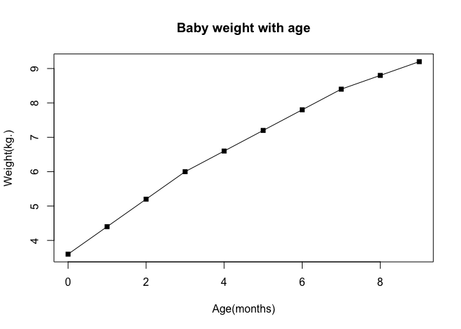
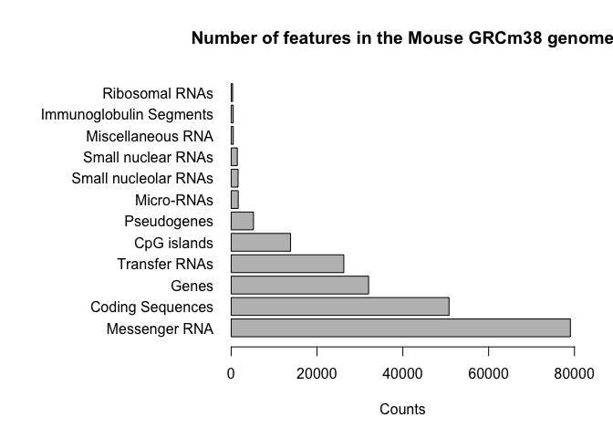
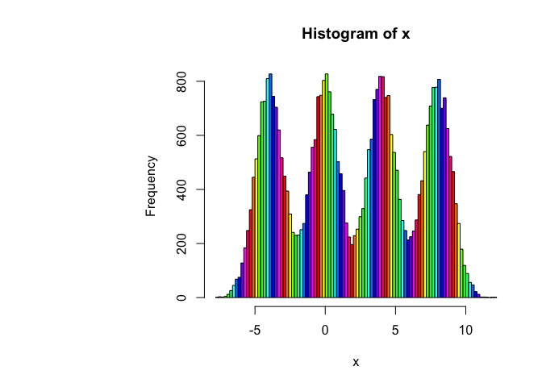
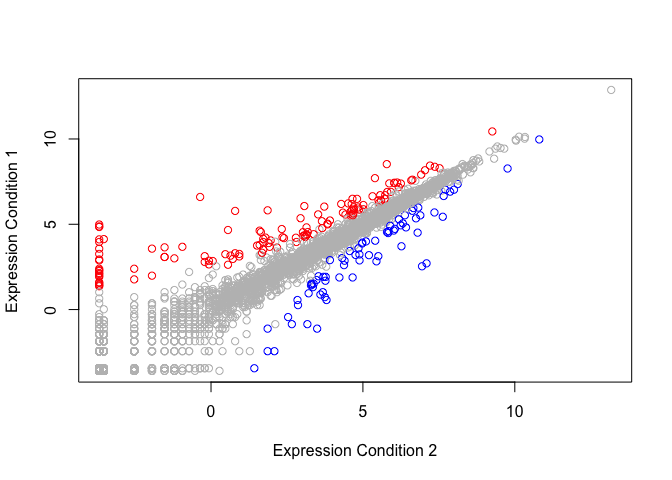
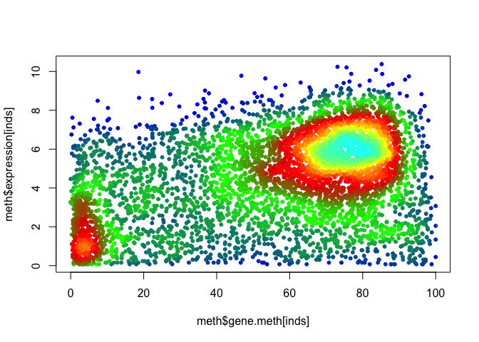

Data Visualization
================
Raghav Chanchani
12/4/2018

Lineplot
--------

Plot square point and line graph with Age(months) x-axis and Weight(kg.) y-axis.

``` r
#read space separated file with header variables.
weight_df <- read.table("bimm143_05_rstats/weight_chart.txt", header = TRUE)
plot(weight_df, pch = 15, type = "o", main = "Baby weight with age", xlab = "Age(months)",
     ylab = "Weight(kg.)")
```



Barplot
-------

Adjust the margin sizes to include all y-axis labels with par(mar=c(...)) Create a horizontal barplot with feature names in y-axis and counts in x-axis and a histogram with different coloring schemes, based on the number of bins.

``` r
features_df <- read.table("bimm143_05_rstats/feature_counts.txt", header = TRUE, sep = "\t")
par(mar = c(5.1,13.1,4.1,2.1) + 0.1)
barplot(features_df$Count, horiz = TRUE, names.arg = features_df$Feature, las = 1,
        xlab = "Counts", xlim = c(0,80000), main = "Number of features in the Mouse GRCm38 genome")
```



``` r
# Histogram of four normal distributions with mean four apart
hist(c(rnorm(10000)-4,rnorm(10000),rnorm(10000)+4,rnorm(10000)+8), xlab = "x",
     main = "Histogram of x", breaks = 100, col = rainbow(nrow(features_df)))
```



Scatter Plots
-------------

Coloring by value scatter plot. Scatter plot of gene expression against Condition1 and Condition2.

``` r
genes <- read.table("bimm143_05_rstats/up_down_expression.txt", header = TRUE, sep = "\t")
palette(c("blue","gray","red"))
# number of genes
nrow(genes)
```

    ## [1] 5196

``` r
plot(genes$Condition1, genes$Condition2, col = genes$State, ylab = "Expression Condition 1",
     xlab = "Expression Condition 2")
```



Dynamic use of color. Set color based on density of non-zero expression methylation datapoints. Scatter plot of methylation data using density colorscheme (default in blue).

``` r
meth <- read.delim("bimm143_05_rstats/expression_methylation.txt")
inds <- meth$expression > 0
colPal <- colorRampPalette(c("blue","green","red", "yellow", "cyan"))
cols <- densCols(meth$gene.meth[inds],meth$expression[inds],colramp = colPal)
plot(meth$gene.meth[inds], meth$expression[inds], col = cols, pch = 20)
```


