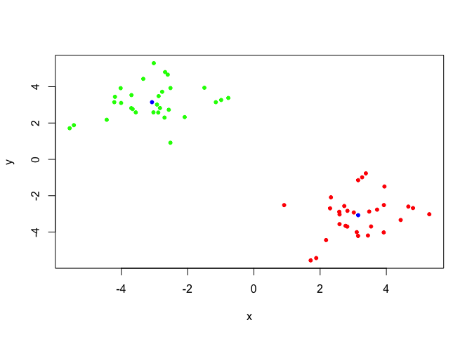
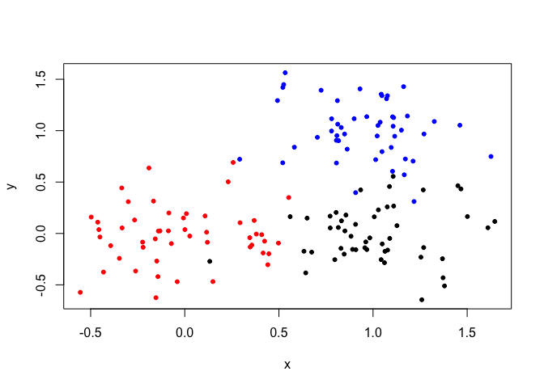

Overview of Machine Learning
================
Raghav Chanchani
10/25/2018

K-means Clustering
------------------

Our first example with the **kmeans()** function.

``` r
# Example plot to see how Rmarkdown works
plot(1:10, typ = "l")
```


Back to kmeans...

``` r
# Generate example data for clustering k = 2
tmp <- c(rnorm(30,-3), rnorm(30,3))
x <- cbind(x = tmp, y = rev(tmp))
k <- kmeans(x,2, iter.max = 100, nstart = 20)
table(k$cluster)
```

    ## 
    ##  1  2 
    ## 30 30

``` r
table(k$size)
```

    ## 
    ## 30 
    ##  2

``` r
k$centers
```

    ##           x         y
    ## 1  3.148212 -3.073397
    ## 2 -3.073397  3.148212

``` r
palette(c(rainbow(3)))
plot(x, col = k$cluster, pch = 20)
points(k$centers, col = "blue", pch = 20)
```

 There are 30 points in each cluster. Cluster size is given by `k$size`, where k is the kmean object returned by kmeans. The points in each cluster are shown in `k$cluster`. Centers of the clusters are stored in `k$centers`.

``` r
# Generate example data for clustering k = 3
tmp <- c(rnorm(30,-3), rnorm(30,3))
x <- cbind(x = tmp, y = rev(tmp))
k <- kmeans(x,3, iter.max = 100, nstart = 20)
table(k$cluster)
```

    ## 
    ##  1  2  3 
    ## 30 20 10

``` r
table(k$size)
```

    ## 
    ## 10 20 30 
    ##  1  1  1

``` r
k$centers
```

    ##           x         y
    ## 1 -2.801569  3.054904
    ## 2  3.882089 -2.842138
    ## 3  1.400535 -2.720431

``` r
palette(c(rainbow(3)))
plot(x, col = k$cluster, pch = 20)
points(k$centers, col = "magenta", pch = 20)
```


The lower total sum of squares within the cluster (smallest variances) is when k = 3, but that is not always best. The k at the inflection point of the scree plot is ideal.

Hierarchical Clustering
-----------------------

R uses **hclust()** for hierarchical clustering. This function needs a distance matrix as input.

``` r
tmp <- c(rnorm(30,-3), rnorm(30,3))
x <- cbind(x = tmp, y = rev(tmp))
d <- dist(x)
hc <- hclust(d)
plot(hc)
```


### A more 'real' set of data...

``` r
x <- rbind(
  matrix(rnorm(100, mean=0, sd = 0.3), ncol = 2),   # c1
  matrix(rnorm(100, mean = 1, sd = 0.3), ncol = 2), # c2
  matrix(c(rnorm(50, mean = 1, sd = 0.3),           # c3
           rnorm(50, mean = 0, sd = 0.3)), ncol = 2))
colnames(x) <- c("x", "y")
palette(c("red", "blue", "black"))
col <- as.factor( rep(c("c1","c2","c3"), each=50) )
plot(x, col=col, pch=20)
```



With two and three clusters...

``` r
distances <- dist(x)
hc <- hclust(distances)
plot(hc)
```


``` r
k2 <- cutree(hc, k = 2)
k3 <- cutree(hc, k = 3)
```

Principal Component Analysis
----------------------------

``` r
mydata <- matrix(nrow = 100, ncol = 10)

rownames(mydata) <- paste("gene", 1:100, sep="")
colnames(mydata) <- c( paste("wt", 1:5, sep=""),
                       paste("ko", 1:5, sep="") )
for(i in 1:nrow(mydata)) {
  wt.values <- rpois(5, lambda=sample(x=10:1000, size=1))
  ko.values <- rpois(5, lambda=sample(x=10:1000, size=1))
  mydata[i,] <- c(wt.values, ko.values)
}


# transpose t() is used to rearrange the matrix to be used by prcomp()
# scale = TRUE changes units to be comaprable across variables
pca <- prcomp(t(mydata), scale=TRUE)
attributes(pca)
```

    ## $names
    ## [1] "sdev"     "rotation" "center"   "scale"    "x"       
    ## 
    ## $class
    ## [1] "prcomp"

``` r
## A vector of colors for wt and ko samples
colvec <- colnames(mydata)
colvec[grep("wt", colvec)] <- "red"
colvec[grep("ko", colvec)] <- "blue"

## Press ESC to exit...
pca.var <- pca$sdev^2
pca.var.per <- round(pca.var/sum(pca.var)*100, 1)
barplot(pca.var.per, main="Scree Plot",
        xlab="Principal Component", ylab="Percent Variation")
```


``` r
plot(pca$x[,1], pca$x[,2], col=colvec, pch=16,
     xlab=paste0("PC1 (", pca.var.per[1], "%)"),
     ylab=paste0("PC2 (", pca.var.per[2], "%)"))
```


``` r
## Lets focus on PC1 as it accounts for > 90% of variance
loading_scores <- pca$rotation[,1]
gene_scores <- abs(loading_scores)

## Sort by magnitudes from high to low
gene_score_ranked <- sort(gene_scores, decreasing=TRUE) ## Find the names of the top 5 genes
top_5_genes <- names(gene_score_ranked[1:5])

## Show the scores (with +/- sign)
pca$rotation[top_5_genes,1]
```

    ##     gene43     gene77     gene96     gene55     gene75 
    ## -0.1064823  0.1064241 -0.1064219 -0.1064213 -0.1064050

UK Food Data Principal Component Analysis
-----------------------------------------

``` r
food.data <- read.csv("data/UK_foods.csv")
rownames(food.data) <- food.data[,1]
food.data <- food.data[,-1]
dim(food.data)
```

    ## [1] 17  4

``` r
knitr::kable(food.data, caption="The full UK foods data table")
```

|                     |  England|  Wales|  Scotland|  N.Ireland|
|---------------------|--------:|------:|---------:|----------:|
| Cheese              |      105|    103|       103|         66|
| Carcass\_meat       |      245|    227|       242|        267|
| Other\_meat         |      685|    803|       750|        586|
| Fish                |      147|    160|       122|         93|
| Fats\_and\_oils     |      193|    235|       184|        209|
| Sugars              |      156|    175|       147|        139|
| Fresh\_potatoes     |      720|    874|       566|       1033|
| Fresh\_Veg          |      253|    265|       171|        143|
| Other\_Veg          |      488|    570|       418|        355|
| Processed\_potatoes |      198|    203|       220|        187|
| Processed\_Veg      |      360|    365|       337|        334|
| Fresh\_fruit        |     1102|   1137|       957|        674|
| Cereals             |     1472|   1582|      1462|       1494|
| Beverages           |       57|     73|        53|         47|
| Soft\_drinks        |     1374|   1256|      1572|       1506|
| Alcoholic\_drinks   |      375|    475|       458|        135|
| Confectionery       |       54|     64|        62|         41|

``` r
library(pheatmap)
pheatmap(as.matrix(food.data))
```


``` r
pca <- prcomp( t(food.data) )
summary(pca)
```

    ## Importance of components:
    ##                             PC1      PC2      PC3       PC4
    ## Standard deviation     324.1502 212.7478 73.87622 4.189e-14
    ## Proportion of Variance   0.6744   0.2905  0.03503 0.000e+00
    ## Cumulative Proportion    0.6744   0.9650  1.00000 1.000e+00
